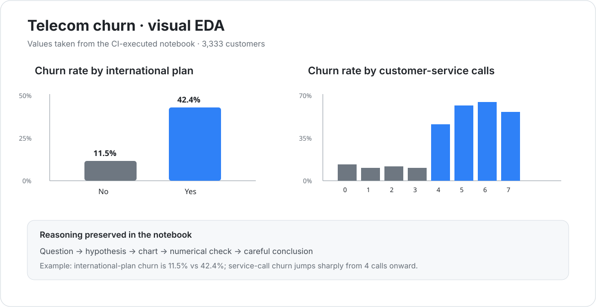
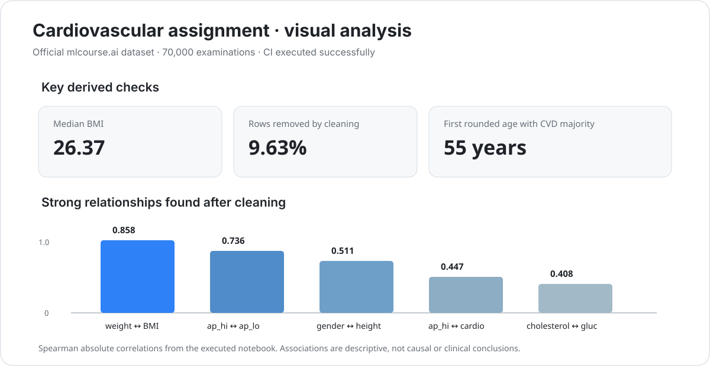

<div align="center">

# Topic 02 · Visual Data Analysis

### Turning analytical questions into useful visual evidence

[](../README.md)
[](https://matplotlib.org/)
[](https://seaborn.pydata.org/)
[](https://github.com/JSwhiz/mlcourse/actions/workflows/notebooks-ci.yml)
[](./)

**Distributions · categories · comparisons · correlations · EDA · visual reasoning**

[← Repository](../README.md) · [Course Topic 02](https://mlcourse.ai/book/topic02/topic02_intro.html) · [Knowledge map](../obsidian/01%20-%20Topics/Topic%2002%20-%20Visual%20Data%20Analysis/Topic%2002%20-%20Обзор.md)

</div>

---

## Goal

Topic 02 is about using visualization as an analytical instrument rather than decoration. Every plot in this topic follows the same reasoning pattern:

```text
question
   ↓
feature types
   ↓
choose the plot
   ↓
inspect the pattern
   ↓
check with numbers
   ↓
state a careful conclusion
```

The notebooks deliberately include short **Reasoning** blocks. They preserve the useful, reviewable analytical logic — what is being tested, why a chart is appropriate, what numerical check follows, and what cannot be concluded from the chart alone.

## Notebooks

| Notebook | Focus | Status |
|---|---|:---:|
| [`01_visual_analysis_toolbox.ipynb`](./notebooks/01_visual_analysis_toolbox.ipynb) | Core visual-analysis patterns on telecom churn | 🟢 |
| [`02_telecom_churn_visual_eda.ipynb`](./notebooks/02_telecom_churn_visual_eda.ipynb) | End-to-end visual EDA and feature hypotheses | 🟢 |
| [`03_cardio_visual_assignment.ipynb`](./notebooks/03_cardio_visual_assignment.ipynb) | mlcourse.ai cardiovascular demo assignment | 🟢 |

The data is loaded from the official public `mlcourse.ai` repository. A clean GitHub Actions runner successfully executed all notebooks, including the cardiovascular analysis on the original 70,000-row dataset.

## Real visual previews

The following previews are **derived from the actual values produced by the CI-executed notebooks**, rather than decorative mockups. Click a preview to open the corresponding notebook.

### Telecom churn visual EDA

<a href="./notebooks/02_telecom_churn_visual_eda.ipynb">
  
</a>

The executed analysis shows, among other checks, an observed churn rate of about **11.5%** without an international plan versus **42.4%** with one, and a sharp increase in observed churn rate from four customer-service calls onward. These are modeling hypotheses and descriptive associations, not causal claims.

### Cardiovascular visual assignment

<a href="./notebooks/03_cardio_visual_assignment.ipynb">
  
</a>

The CI-executed assignment confirms the full original dataset size of **70,000 rows**, computes a median BMI of about **26.37**, removes **9.63%** of rows under the assignment's cleaning rule, and finds age **55** as the first rounded age in the cleaned sample where CVD observations outnumber non-CVD observations.

## Learning checklist

| Block | Skill | Status |
|---|---|:---:|
| 01 | Match a chart to an analytical question | 🟢 |
| 02 | Histograms and KDE | 🟢 |
| 03 | Box plots and violin plots | 🟢 |
| 04 | Count plots and grouped categorical comparisons | 🟢 |
| 05 | Scatter plots and multivariate encoding | 🟢 |
| 06 | Pearson and Spearman heatmaps | 🟢 |
| 07 | Compare distributions by target | 🟢 |
| 08 | Detect suspicious observations visually | 🟢 |
| 09 | Build and test feature hypotheses | 🟢 |
| 10 | Avoid causal claims from descriptive plots | 🟢 |

## The rule I want to keep

A visualization is useful only when I can finish this sentence:

> **I am drawing this chart because I want to check whether ...**

If I cannot formulate the question, the chart is probably decorative.

## Knowledge notes

All personal notes that sync to Obsidian are written in Russian:

- [Topic 02 — Обзор](../obsidian/01%20-%20Topics/Topic%2002%20-%20Visual%20Data%20Analysis/Topic%2002%20-%20Обзор.md)
- [Как выбирать график](../obsidian/01%20-%20Topics/Topic%2002%20-%20Visual%20Data%20Analysis/Визуализация%20-%20Как%20выбирать%20график.md)
- [Распределения и выбросы](../obsidian/01%20-%20Topics/Topic%2002%20-%20Visual%20Data%20Analysis/Визуализация%20-%20Распределения%20и%20выбросы.md)
- [Корреляции](../obsidian/01%20-%20Topics/Topic%2002%20-%20Visual%20Data%20Analysis/Визуализация%20-%20Корреляции.md)
- [Подробная выжимка](../obsidian/01%20-%20Topics/Topic%2002%20-%20Visual%20Data%20Analysis/Topic%2002%20-%20Подробная%20выжимка.md)
- [Быстрая шпаргалка](../obsidian/03%20-%20Cheatsheets/Визуализация%20-%20Быстрая%20шпаргалка.md)

## What I carry into later topics

Topic 02 does not decide the final model. It produces testable hypotheses for later work:

- which features visibly separate the target classes;
- where threshold-like behavior may exist;
- which measurements deserve cleaning or investigation;
- which features are nearly redundant;
- where class imbalance affects interpretation;
- which visual patterns should be validated out of sample.

## Definition of done

- [x] every notebook runs top-to-bottom in CI;
- [x] every chart has an explicit analytical purpose;
- [x] important visual conclusions are checked numerically;
- [x] the official cardiovascular demo assignment is reproduced on the original data;
- [x] Russian Obsidian notes contain the reusable concepts;
- [x] README navigation and real result-derived previews are up to date.

---

<div align="center">

### Topic 02 completed

[← Topic 01](../topic01_pandas_data_analysis) · [Repository](../README.md) · [Detailed Russian summary](../obsidian/01%20-%20Topics/Topic%2002%20-%20Visual%20Data%20Analysis/Topic%2002%20-%20Подробная%20выжимка.md)

</div>
