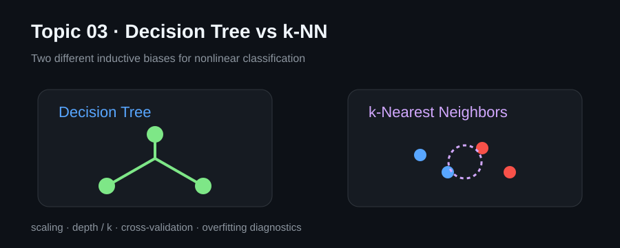

# Topic 03 · Classification, Decision Trees & k-NN

This topic turns classification into an explicit decision process: establish a baseline, split data correctly, compare model families, diagnose overfitting, and validate conclusions with cross-validation.

## Notebooks

- [`01_trees_vs_knn.ipynb`](./notebooks/01_trees_vs_knn.ipynb) — decision trees, k-NN, scaling, depth and neighborhood size.
- [`02_classification_boundaries.ipynb`](./notebooks/02_classification_boundaries.ipynb) — nonlinear data, decision boundaries and cross-validation.

## Reasoning pattern

`problem → target → split → baseline → model assumptions → validation → error analysis`

## Key ideas

- trees partition feature space with interpretable rules;
- unrestricted trees overfit easily;
- k-NN is distance-based and therefore sensitive to scaling;
- hyperparameters must be selected using validation data, not the test set;
- accuracy alone can be misleading for imbalanced targets.

## Knowledge

Russian long-term notes: [`Topic 03 — Подробная выжимка`](../obsidian/01%20-%20Topics/Topic%2003%20-%20Decision%20Trees%20and%20kNN/Topic%2003%20-%20Подробная%20выжимка.md).

[← Topic 02](../topic02_data_visualization) · [Repository](../README.md)
