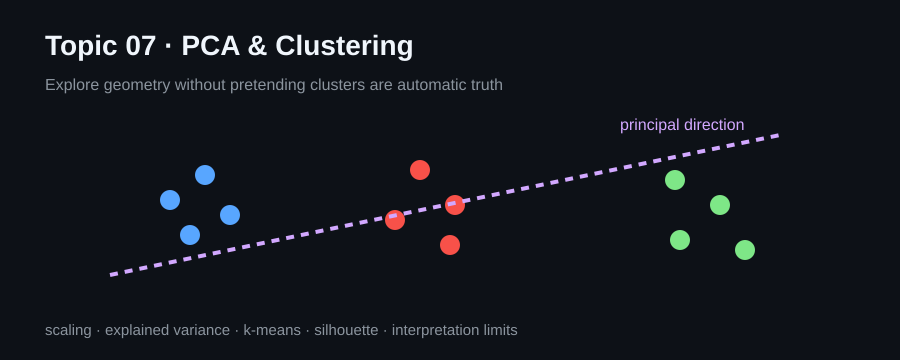

# Topic 07 · Unsupervised Learning

This topic covers PCA and clustering as tools for representation, exploration and compression rather than automatic truth-discovery.

## Notebooks
- [`01_pca.ipynb`](./notebooks/01_pca.ipynb) — scaling, explained variance and reconstruction intuition.
- [`02_clustering.ipynb`](./notebooks/02_clustering.ipynb) — k-means, silhouette score and cluster interpretation.

Reasoning: `geometry → scaling → representation/clusters → internal metric → domain interpretation`.

Russian notes: [`Topic 07 — Подробная выжимка`](../obsidian/01%20-%20Topics/Topic%2007%20-%20Unsupervised%20Learning/Topic%2007%20-%20Подробная%20выжимка.md).

[← Topic 06](../topic06_feature_engineering_selection) · [Repository](../README.md)
